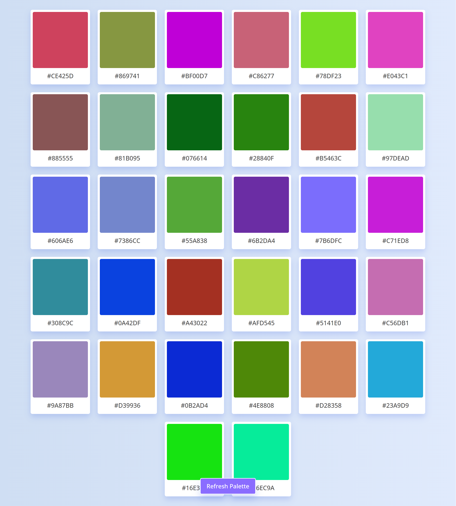

# 🎨 Random Color Palette Generator

Welcome to the Random Color Palette Generator! This tool provides an infinite array of color palettes via API, perfect for your design projects and creative endeavors.

## Usage

Simply integrate the API into your project to access limitless color combinations. Whether you're designing a website, creating art, or developing an app, this generator offers a diverse range of colors to suit your needs.

## Demo

Explore a live demonstration of the Random Color Palette Generator [here](https://shakiba-vakili.github.io/random-color-palette-generator/).

## Additional Resources

- **LinkedIn:** Let's connect for collaborations! [Shakiba Sadat Vakili](https://www.linkedin.com/in/shakiba-vakili/) 
- **Email:** Reach out to me at [shakibvakili@gmail.com](mailto:shakibvakili@gmail.com) for any inquiries or collaborations.
- **GitHub:** Visit [@shakiba-vakili](https://github.com/shakiba-vakili) on GitHub for more projects and contributions.
